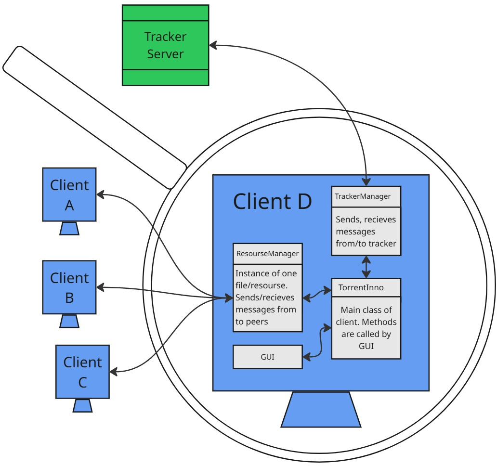
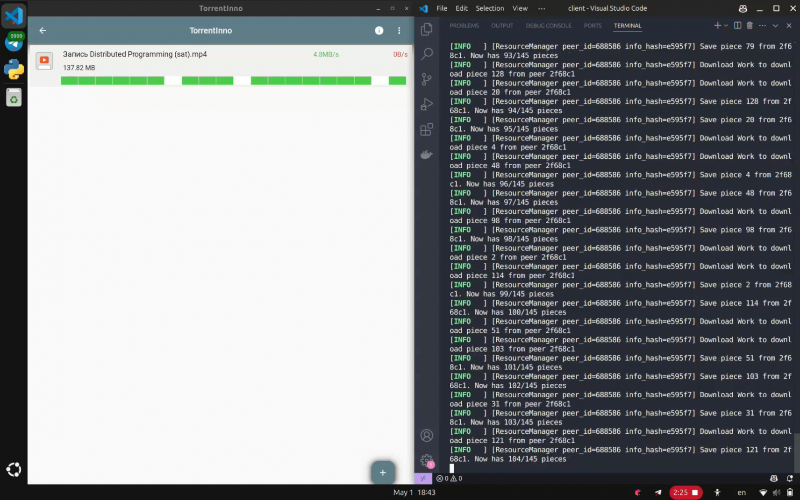

# TorrentInno 
Decentralized P2P File Sharing System
> 

## Overview
A BitTorrent-inspired peer-to-peer file sharing system with:
- **Tracker** (Go): Central peer coordination server
- **Client** (Python): GUI-based file sharing client
- **Protocol**: Custom P2P communication protocol

## Project Documentation
[View comprehensive project report](specs/TorrentInno.pdf)

## Demo

## Features
- **Distributed File Sharing**: Direct peer-to-peer transfers
- **Piece-based Transfers**: Parallel downloading/uploading
- **Tracker Coordination**: Peer discovery service
- **Resumable Downloads**: Partial file recovery
- **GUI Client**: Real-time transfer monitoring

## Installation guide
1) Clone the repository
2) Ensure `poetry` version 2.1.2 is installed on your system
3) Change the directory to `client`
4) In the `client` directory, run `poetry install`

Now you have two options to use the project
- Enter `poetry run cli` to run the CLI
- Enter `poetry run python3 gui/app.py` to run the GUI application
